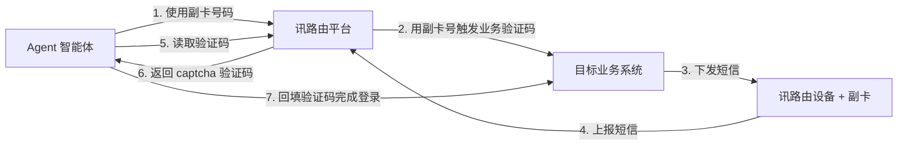

# Agent 智能体获取手机号接收验证码的方法

> 适用读者：使用 OpenClaw、Hermes 等主流 Agent 平台，或自研智能体（LLM Workflow / RPA / 自动化脚本）的用户
> 前置条件：已开通 N+SMS 讯路由账号，并持有讯路由智能设备
> 阅读时长：约 8 分钟；按本文三步操作，即可让 Agent 全自主完成"登录 → 收码 → 回填"

---

## 一、为什么 Agent 需要一张自己的"副卡"

Agent 智能体最擅长的，是自主完成信息获取与业务操作。但真正有价值的信息——订单明细、账单数据、私域平台搜索查询——几乎都需要**登录**才能查看。于是 Agent 经常被卡在最后一公里：

- **用主账号**：每次登录触发短信验证码，都需要人工配合——看一眼手机、把验证码报给 Agent。流程被反复打断，无法完全由 Agent 自主闭环；
- **主账号暴露给自动化**：Agent 的自动化操作一旦触碰平台的反机器人风控（验证码频繁、行为特征异常），可能连累主账号被限流、被锁定，得不偿失。

这套方案的解法很简单：**给 Agent 申请一张副卡**。

- 副卡装入讯路由智能设备后，号码成为平台里可管理的资产，Agent 用它完成必要的注册与登录；
- 验证码由 Agent 通过接口自动获取，**全程无人工配合**，任务真正实现全自动闭环；
- **账号隔离**：所有自动化操作都发生在副卡注册的账号上，主账号完全不参与自动化流程，从源头规避反机器人风控对主账号的影响；
- **全程留痕**：副卡收到的每一条短信，在 SaaS 后台的消息管理中都有完整记录——什么时间、什么内容、被哪条流程使用，一目了然，事后可审计；
- **实时掌控**：如果还想更放心，可以在通知通道里配一条"转发给自己"（企业微信 / 钉钉 / 飞书均可），副卡一有短信进来立刻推送到你手上，号码的使用情况实时可见。

方便与安全，兼得。

## 二、方案总览：一“人”一机一副卡

整个方案的标准配置是**一“人”一机一副卡**：每个 Agent 一张副卡、一台设备，设备放在办公室插电即用，Agent 通过平台读取这张副卡收到的验证码。



## 三、3步启用

### 第一步：开通副卡，装入设备

副卡的开销很低、开通也快——在主套餐下加办一张副卡，运营商营业厅或官方 APP 都能办理，通常几分钟搞定申请，快递到家。拿到副卡后：

1. 将副卡装入讯路由智能设备（Type-C 供电，插电即用，无需 Wi-Fi，有手机信号即可在线）；
2. 登录管理后台 **设备管理** 页面，确认设备已上线：


| 字段 | 作用 | 你需要确认的 |
|---|---|---|
| 在线状态 | 设备当前是否联网 | ✅ 在线 |
| 最后上报 | 设备最近一次上报时间 | 时间新鲜（非长时间未上报） |
| 号码 | 设备当前 SIM 号码 | 即副卡号码，记下来 |

> 建议顺手给设备设置一个便于识别的 `设备名称`（如"Agent 副卡-王工"），人员与号码的对应关系一目了然。

### 第二步：启用接码 Skill

平台已为 OpenClaw、Hermes 等主流 Agent 平台封装了现成的 Skill，开箱即用👇：

**https://github.com/SyncMeIn/sms-otp-skill**

按仓库说明安装启用后，Agent 即获得"取验证码"能力。Skill 内部封装了与平台 API 的全部交互——鉴权、轮询节奏、超时控制——你不需要处理任何底层细节。

### 第三步：把副卡号码交给 Agent

将第一步记下的副卡号码配置给 Agent（写入 Skill 配置或系统提示词均可）。至此，全部配置完成。

此后 Agent 遇到需要验证码的登录 / 注册环节，自主完成整个循环：**记录时间 → 触发验证码 → 读取验证码 → 回填**，无需人工参与。

## 四、为什么可以放心把副卡交给 Agent

- **卡在你手里**：副卡始终插在你办公室的设备中，物理可控；
- **全程留痕**：消息管理页可检索每一条收发记录，配合转发记录的三态状态（发送成功 / 发送失败 / 规则过滤），谁在什么时候用这张卡收了什么码，全程可回溯；
- **实时掌控**：通知通道配置"转发给自己"，副卡每次收到短信都会实时推送到你的企微 / 钉钉 / 飞书，异常使用第一时间发现；
- **权限隔离**：系统支持"收短信"与"看短信"权限分离，团队成员可各管各的副卡，互不可见；
- **只收不发**：设备固件层面锁死短信发送（TX）能力，仅接收与转发，从根源上杜绝副卡被滥用发送垃圾短信的可能。

## 五、技术细节（补充参考）

> 使用官方 Skill 的用户可跳过本节。以下内容供自研智能体、创新功能用途、或需要底层 API 集成的开发者参考。

### 1. 被动轮询 API：`GET /api/resent`

| 项目 | 说明 |
|---|---|
| 端点 | `GET /api/resent` |
| 鉴权 | Header 携带 `Authorization: Bearer {api_token}`（Token 在管理后台 API 控制台获取） |
| 限流 | 默认 **5 秒 16 次**（调用方应自行做间隔轮询与超时控制） |

请求参数：

| 参数 | 类型 | 必填 | 说明 |
|---|---|---|---|
| `phone` | string | ✅ | 副卡号码 |
| `sendTimeSec` | int | ✅ | Unix **秒级**时间戳，只返回此时间**之后**收到的短信 |
| `title` | string | ❌ | 短信抬头（按正文 `【xxx】` / `[xxx]` 提取，不含括号）；非空时精确匹配，留空则返回最新一条 |

cURL 示例：

```bash
curl --request GET "https://sms.gqmg.com/api/resent?phone=138****8000&title=蒲岐实业&sendTimeSec=1762481605" \
  --header "Authorization: Bearer {your_api_token}"
```

命中响应（`captcha` 为平台提取好的验证码，默认规则 `\d{4,8}`）：

```json
{
  "code": 200,
  "msg": "已找到最新短信",
  "data": {
    "found": true,
    "phone": "138****8000",
    "title": "蒲岐实业",
    "captcha": "289342",
    "content": "【蒲岐实业】您的登录验证码为：289342",
    "sendTimeSec": "2025-11-07 10:13:25",
    "receiveTime": "2025-11-07 10:13:27"
  }
}
```

未命中（继续轮询）：

```json
{ "code": 200, "msg": "未找到符合条件的短信", "data": { "found": false } }
```

### 2. Python 参考实现

```python
import time
import requests

API_BASE = "https://sms.gqmg.com"
API_TOKEN = "your_api_token"  # 建议从环境变量读取


def poll_captcha(phone: str, title: str = "", timeout: int = 120) -> str:
    """轮询获取验证码：调用前必须已触发业务方下发短信。"""
    send_time_sec = int(time.time())  # 关键：在触发动作前/同时记录时间戳
    deadline = time.time() + timeout

    while time.time() < deadline:
        resp = requests.get(
            f"{API_BASE}/api/resent",
            params={"phone": phone, "title": title, "sendTimeSec": send_time_sec},
            headers={"Authorization": f"Bearer {API_TOKEN}"},
            timeout=10,
        )
        data = resp.json().get("data", {})
        if data.get("found"):
            return data["captcha"]       # 例如 "289342"
        time.sleep(2.5)                  # 低于限流：5 秒 16 次
    raise TimeoutError(f"{phone} 在 {timeout}s 内未收到验证码")
```

四个容易踩坑的点：

1. `sendTimeSec` 必须在**触发验证码之前**生成，否则会漏掉刚到的短信（时间边界判定：接收时间早于该时间戳一律返回未找到）；
2. `title` 传业务抬头（如 `蒲岐实业`）可精确锁定目标短信；留空则"谁新取谁"；
3. 轮询间隔 2~3 秒并设总超时（60~120 秒），既不触发限流又不会死循环；
4. 平台从设备收到短信到入库平均延迟约 1.5 秒，轮询前先等 1~2 秒性价比更高。

### 3. Webhook 主动推送（替代轮询）

若 Agent 服务有公网回调地址，可在 **通知通道** 新增 `custom_json` 类型通道并开启模板，短信到达即推送：

```json
{
  "event": "sms.forward",
  "title": "$title",
  "code": "$code",
  "sender": "$sender",
  "receiver": "$receiver",
  "receiveTime": "$receiveTime",
  "content": "$content"
}
```

在 **转发配置** 中把该通道挂到副卡所在设备上；如只需特定业务短信，可叠加过滤条件（如"短信内容 包含 验证码"）。保存后先点"测试通知"确认可达。

### 4. 自定义验证码提取（解析规则）

默认提取规则 `\d{4,8}` 覆盖绝大多数验证码短信。若业务短信格式特殊，到 **解析规则** 页面定制：`短信抬头`（不含括号）+ `验证码正则`（至少一个提取分组），正则先用测试短信验证再启用；同一签名有多种模板时拆成多条规则、用优先级控制匹配顺序。解析结果会直接体现在 `captcha` 字段中。

### 5. 收不到码？排障清单

| 现象 | 首先检查 | 结论 |
|---|---|---|
| 轮询一直 `found: false` | **设备管理**：在线状态、最后上报 | 设备离线，短信没到平台 |
| 短信到平台仍取不到 | **消息管理**（筛选"仅接收"）确认入库、核对号码 | 卡号不符或被运营商拦截 |
| 入库且号码正确仍取不到 | `sendTimeSec` 是否晚于短信接收时间；`title` 是否与抬头精确一致 | 时间边界 / 抬头匹配问题 |
| 偶发取不到 | 调用频率是否触发限流（429错误） | 加大轮询间隔 |
| 验证码提取错误 | **解析规则**中该抬头的正则 | 修正正则后测试验证 |
| Webhook 收不到 | **消息详情 → 转发记录**：是"规则过滤"还是"发送失败" | 过滤=条件未命中；失败=看调试 JSON（`reqObj`/`resObj`）排通道问题 |

经验法则：**有转发记录但失败 → 通道问题；完全没有记录 → 规则未命中或设备未上报**。

---

## 六、总结

Agent 智能体获取手机号接收验证码的方法，归结为三句话：

1. **一张副卡**：从主套餐加办副卡、装入设备，开通便捷成本低，Agent 与主账号彻底隔离，风控互不影响；
2. **一个 Skill**：启用官方接码 Skill（github.com/SyncMeIn/sms-otp-skill），Agent 自主完成登录注册环节的收码回填，全程无人工配合；
3. **一套安心机制**：SaaS 后台全程留痕可审计，配一条"转发给自己"即可实时掌控号码动态，卡始终在你手里。

从此，"验证码"对 Agent 而言不再是人工干预点——副卡在手，登录注册全自主，主账号高枕无忧。

---

*相关阅读：[SMS-OTP-skill @ Github](https://github.com/SyncMeIn/sms-otp-skill/) · [被动轮询 API 对接说明](https://sms.gqmg.com/help/resent-api/) · [通知通道配置](https://sms.gqmg.com/help/notify-channel-edit/) · [解析规则](https://sms.gqmg.com/help/parse-rules/) · [设备管理](https://sms.gqmg.com/help/devices-management/)*
